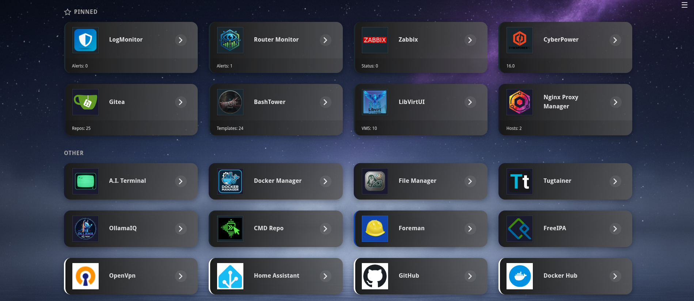

# Dashboard

A self-hosted application dashboard built with Python and Flask.


 
  <a href="https://hub.docker.com/r/ftsiadimos/lightdockerwebui"></a>
  <a href="https://ghcr.io/ftsiadimos/dashboard"></a>
  <a href="https://github.com/ftsiadimos/lightdockerwebui/blob/main/LICENSE"></a>

## Screenshot

<p align="center">
  
</p>
<p align="center"><em>Dashboard</em></p>

---

## Features

- **Application Management** — Add, edit, delete, and organize web applications
- **Categories** — Group applications into categories
- **Pin Favorites** — Pin important apps to the top of the dashboard
- **Custom Icons** — Upload icons for each application
- **Color Coding** — Assign colors to visually distinguish apps (picker and text input are synced)
- **API Integration** — Fleximple API lets any HTTP endpoint drive a tile with templated data
- **Search Bar** — Configurable web search integrated into the dashboard
- **Hideable Top Bar** — turn off the navigation header from settings for a minimalist look
- **Responsive Grid** — Configurable column count with responsive breakpoints
- **Background Image** — Set a custom background image URL
- **Dark Theme** — Modern dark UI out of the box
- **SQLite Storage** — Lightweight, zero-config database
- **Docker Ready** — Dockerfile and docker-compose included

## 📦 Installation Options

<details>
<summary><b>🐳 Docker (Recommended)</b></summary>

```bash
# Pull and run using Docker Hub
docker pull ftsiadimos/dashboard:latest

docker run -d --restart unless-stopped \
  -p 6008:6008 \
  --name=dashboard \
  -v $(pwd)/data:/app/data \
  ftsiadimos/dashboard:latest

# or pull from GitHub Container Registry
docker pull ghcr.io/ftsiadimos/dashboard:latest

docker run -d --restart unless-stopped \
  -p 6008:6008 \
  --name=dashboard \
  -v $(pwd)/data:/app/data \
  ghcr.io/ftsiadimos/dashboard:latest
```

</details>

<details>
<summary><b>📄 Docker Compose</b></summary>

```yaml
# docker-compose.yml
version: '3.8'

services:
  dashboard:
    image: ftsiadimos/dashboard:latest  # or ghcr.io/ftsiadimos/dashboard:latest
    container_name: dashboard
    ports:
      - "6008:6008"
    volumes:
      - ./data:/app/data
    restart: unless-stopped
```

```bash
docker-compose up -d
```

</details>

<details>
<summary><b>🐍 From Source (Development)</b></summary>

```bash
# Clone repository
git clone https://github.com/ftsiadimos/dashboard.git
cd dashboard

# Create virtual environment
python -m venv venv
source venv/bin/activate  # Windows: venv\Scripts\activate

# Install dependencies
pip install -r requirements.txt

# Run application
flask run --host=0.0.0.0 --port=6008
```

</details>

---

## Configuration

The application version is stored in the `VERSION` file and shown on the About page. To update it, bump the value there.

Environment variables:

| Variable | Default | Description |
|---|---|---|
| `SECRET_KEY` | random | Flask secret key |
| `APP_TITLE` | Dashboard | Title shown in navbar and browser tab |

*Navigation visibility can be toggled via the web UI; there is no separate environment variable.*
| `APP_PORT` | 5000 | Port to listen on |
| `APP_HOST` | 0.0.0.0 | Host to bind to |
| `DATABASE_URL` | sqlite:///data/dashboard.db | Database URI |
| `GITHUB_URL` | — | (defaults to https://github.com/ftsiadimos/dashboard.git). Displayed on the About page. |

## Project Structure

```
dashboard/
├── app.py              # Flask application factory
├── config.py           # Configuration
├── database.py         # SQLite setup & migrations
├── routes.py           # All routes (dashboard, CRUD, API)
├── requirements.txt
├── Dockerfile
├── docker-compose.yml
├── static/
│   ├── style.css       # Dark theme CSS
│   ├── app.js          # Frontend JS
│   └── favicon.svg
├── templates/
│   ├── base.html       # Base layout (navigation now includes About link)
│   ├── index.html      # Dashboard home
│   ├── apps.html       # Applications list
│   ├── app_form.html   # Add/Edit application
│   ├── categories.html # Categories list
│   ├── category_form.html
│   ├── settings.html   # Dashboard settings (still includes GitHub repository URL)
│   └── about.html      # About page showing version and repo URL
└── data/               # SQLite db + uploaded icons (created at runtime)
```

## API Integration Examples

Anyone can build their own lightweight monitoring by pointing a tile at a
public or internal HTTP endpoint – we call it a *fleximple API* because it's
both flexible and simple.  The dashboard will make an external request for any
app tile, fetch it at your chosen interval, and render the response using a
small templating syntax.  Think of it as a free-form monitor where the only
requirement is that the endpoint returns some text/json you can parse.

The API section in the **Add/Edit application** form contains all of the fields
used by the examples below.

### Common template tokens

* `{path.to.value}` – dot‑notation path into a JSON object. Arrays are supported
  (e.g. `data.items.0.name`).
* `{_len}` – length of the top‑level array returned by the API. Useful for
  counts.
* `regex:` – prefix a template with `regex:` to extract the first capture group
  from an HTML/text response.

### Example 1 – simple JSON value

```text
API URL            https://status.example.com/api/health
Display Template   Status: {status}
```

If the JSON payload is `{"status":"ok"}` the tile will read `Status: ok`.

### Example 2 – nested JSON and array length

```text
API URL            https://weather.example.com/forecast
Display Template   {forecast.daily.0.temperature}° / {forecast.daily.0.condition}
```

Here we drill into the first element of a nested `forecast.daily` array.

```text
API URL            https://tickets.example.com/open
Display Template   {_len} open tickets
```

With a response like `[{}, {}, {}]` the tile will show `3 open tickets`.

### Example 3 – GET with headers

```text
API URL            https://api.myservice.com/metrics
API Method         GET
Headers            {"Authorization":"Bearer abc123"}
Display Template   CPU: {cpu}%
```

### Example 4 – POST with JSON body

```text
API URL            https://zabbix.example.com/api_jsonrpc.php
API Method         POST
Headers            {"Content-Type":"application/json"}
Payload            {"jsonrpc":"2.0","method":"problem.get","params":{"output":["problemid"],"countOutput":true},"auth":"TOKEN","id":1}
Display Template   {_len} problems
```

This is the alert example shown earlier. a realtime Zabbix call returns a top‑level
array, and `{_len}` displays the count.

### Example 5 – regex extraction from HTML/text

```text
API URL            https://statuspage.example.com
Display Template   regex:<title>([^<]+)</title>
```

The template above grabs whatever is inside the `<title>` tag of the returned
HTML.

---

## License

MIT

