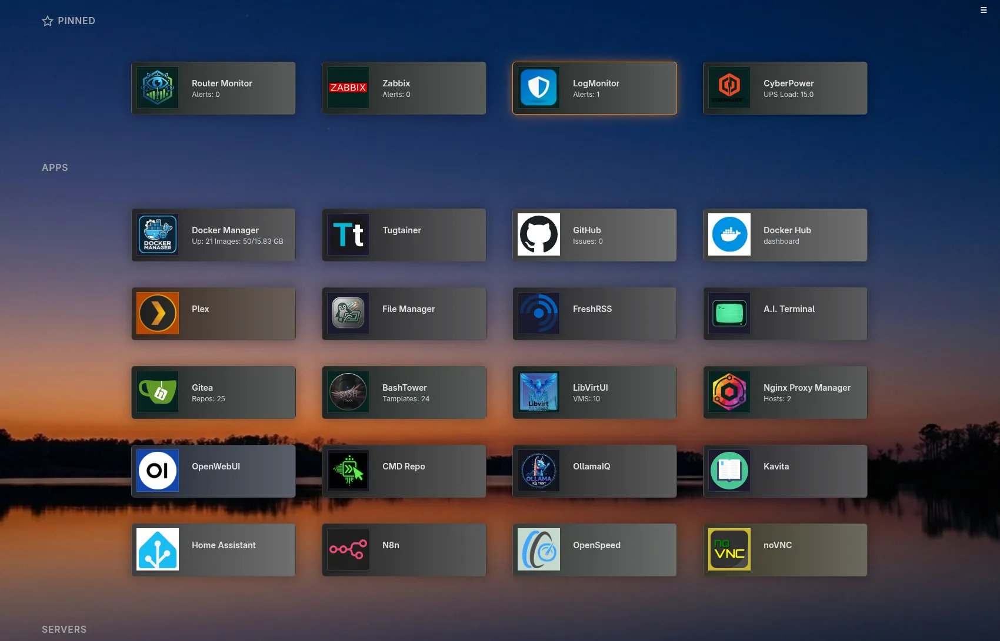
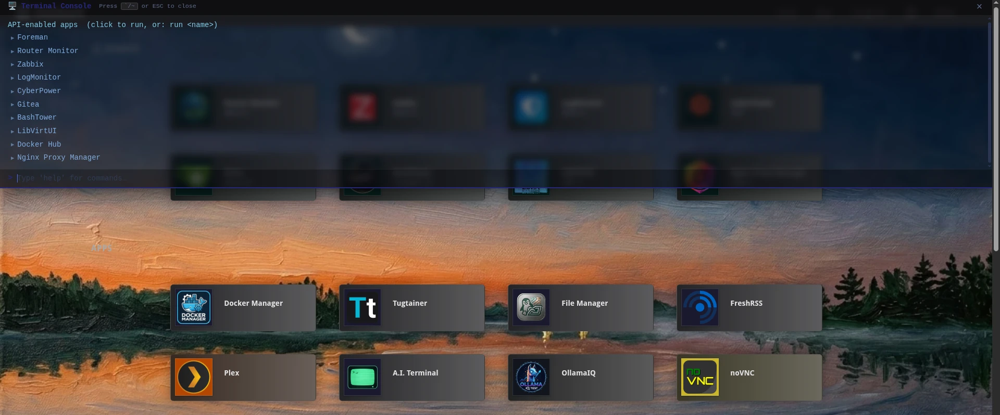

# Dashboard

A lightweight, self-hosted application launcher and monitoring dashboard built with Python + Flask. It is designed to be simple to run, easy to configure, and extendable via API tiles.

<p align="center">
  
  
  <a href="https://hub.docker.com/r/ftsiadimos/lightdockerwebui"></a>
  <a href="https://ghcr.io/ftsiadimos/dashboard"></a>
  <a href="https://github.com/ftsiadimos/lightdockerwebui/blob/main/LICENSE"></a>
</p>


<p align="center">
  
</p>
<p align="center"><em>Dashboard</em></p>

---

## Quick start

1. Choose a deploy option: Docker, Docker Compose, or source install.
2. Start, open http://localhost:6008, and configure via Settings.
3. Add apps to the dashboard and optionally enable API tiles for live statistics.
4. Set alert keywords in Settings (default: `alert,alerts`) to watch for anomalies.

---

## Features

- **Application Management** — Add, edit, delete, and organize web applications
- **Category Support** — Create, edit, reorder, and delete categories with per-category app grouping
- **Pin Favorites** — Pin important applications to keep them at the top
- **Custom Icons** — Upload custom icon files per app or provide an icon URL; remote images are downloaded, resized to 64×64, and saved automatically
- **Color Coding** — Assign a color to apps for visual grouping (picker and hex input synced)
- **API Tiles** — Poll an API endpoint with support for method, headers, payload, interval, and template formatting
- **Blinking Alert Cards** — Highlight app cards with pulsating warning/danger state when alert keywords + counts trigger
- **Bulk App Updates** — Assign multiple apps to a category in one action
- **Import/Export JSON** — Export apps/categories to JSON and import from JSON in settings
- **Search Provider** — Custom search provider and in-dashboard search toggle in settings
- **Hideable Navbar** — Toggle top navigation visibility for a minimalist dashboard mode
- **Responsive Grid** — Automatic column layout with mobile-friendly breakpoints
- **Background Image** — Customizable dashboard background image URL
- **Dark Theme** — Built-in dark styling
- **SQLite Storage** — Local persistent storage with automatic DB setup
- **Docker Support** — Includes `Dockerfile` and `docker-compose.yml` for containerized deployment
- **Quake-style Drop-down Terminal** — Press a configurable hotkey (default `` ` ``) to slide down an in-browser terminal console with app launching, custom HTTP requests, and command history

## 📦 Installation Options

<details>
<summary><b>🐳 Docker (Recommended)</b></summary>

```bash
# Pull and run using Docker Hub
docker pull ftsiadimos/dashboard:latest

docker run -d --restart unless-stopped \
  -p 6008:6008 \
  --name=dashboard \
  -v $(pwd)/data:/app/data \
  ftsiadimos/dashboard:latest

# or pull from GitHub Container Registry
docker pull ghcr.io/ftsiadimos/dashboard:latest

docker run -d --restart unless-stopped \
  -p 6008:6008 \
  --name=dashboard \
  -v $(pwd)/data:/app/data \
  ghcr.io/ftsiadimos/dashboard:latest
```

</details>

<details>
<summary><b>📄 Docker Compose</b></summary>

```yaml
# docker-compose.yml
version: '3.8'

services:
  dashboard:
    image: ftsiadimos/dashboard:latest  # or ghcr.io/ftsiadimos/dashboard:latest
    container_name: dashboard
    ports:
      - "6008:6008"
    volumes:
      - ./data:/app/data
    restart: unless-stopped
```

```bash
docker-compose up -d
```

</details>

<details>
<summary><b>🐍 From Source (Development)</b></summary>

```bash
# Clone repository
git clone https://github.com/ftsiadimos/dashboard.git
cd dashboard

# Create virtual environment
python -m venv venv
source venv/bin/activate  # Windows: venv\Scripts\activate

# Install dependencies
pip install -r requirements.txt

# Run application
flask run --host=0.0.0.0 --port=6008
```

</details>

---


## Project Structure

```
.
├── app.py              # Flask application entrypoint (creates app from dashboard package)
├── dashboard/          # Main application package
│   ├── __init__.py     # App factory, blueprint registration
│   ├── config.py       # Configuration (environment + defaults)
│   ├── database.py     # SQLAlchemy models + DB init/migrations
│   ├── utils.py        # Shared helper functions
│   ├── blueprints/     # Route modules (single shared blueprint)
│   │   ├── __init__.py
│   │   ├── main.py     # Home page, about page, icon endpoint
│   │   ├── apps.py     # Applications CRUD
│   │   ├── categories.py
│   │   ├── settings.py
│   │   └── api.py      # Drag/reorder + stats endpoints
├── requirements.txt
├── docker-compose.yml.example  # Pulls ftsiadimos/dashboard:latest
├── static/
│   ├── style.css       # Dark theme CSS
│   ├── app.js          # Frontend JS
│   └── favicon.svg
├── templates/
│   ├── base.html       # Base layout (navigation now includes About link)
│   ├── index.html      # Dashboard home
│   ├── apps.html       # Applications list
│   ├── app_form.html   # Add/Edit application
│   ├── categories.html # Categories list
│   ├── category_form.html
│   ├── settings.html   # Dashboard settings
│   └── about.html      # About page showing version and repo URL
└── data/               # SQLite db + uploaded icons (created at runtime)
```

## API Integration Examples

Anyone can build their own lightweight monitoring by pointing a tile at a
public or internal HTTP endpoint – we call it a *fleximple API* because it's
both flexible and simple.  The dashboard will make an external request for any
app tile, fetch it at your chosen interval, and render the response using a
small templating syntax.  Think of it as a free-form monitor where the only
requirement is that the endpoint returns some text/json you can parse.

The API section in the **Add/Edit application** form contains all of the fields
used by the examples below.

### Common template tokens

* `{path.to.value}` – dot‑notation path into a JSON object. Arrays are supported
  (e.g. `data.items.0.name`).
* `{_len}` – length of the top‑level array returned by the API. Useful for
  counts.
* `first` / `last` – when resolving an array, use `first` or `last` to pick the
  first or last element, e.g. `{data.items.first.name}`.
* `max_by(field)` / `min_by(field)` – choose the array item with the highest or
  lowest value for a nested field, e.g. `{servers.max_by(cpu).name}`.
* `regex:` – prefix a template with `regex:` to extract the first capture group
  from an HTML/text response. You can also use a prefix before `regex:` like
  `Status: regex:<title>([^<]+)</title>`.

### Example 1 – simple JSON value

```text
API URL            https://status.example.com/api/health
Display Template   Status: {status}
```

If the JSON payload is `{"status":"ok"}` the tile will read `Status: ok`.

### Example 2 – nested JSON and array length

```text
API URL            https://weather.example.com/forecast
Display Template   {forecast.daily.0.temperature}° / {forecast.daily.0.condition}
```

Here we drill into the first element of a nested `forecast.daily` array.

```text
API URL            https://tickets.example.com/open
Display Template   {_len} open tickets
```

With a response like `[{}, {}, {}]` the tile will show `3 open tickets`.

### Example 3 – array selection helpers

```text
API URL            https://status.example.com/api/servers
Display Template   Top host: {servers.max_by(cpu).name}
```

For an array of server objects, `max_by(cpu)` picks the host with the highest
CPU value. You can also use `min_by(field)`, or `first` / `last` to select the
first or last item in a list.

### Example 4 – GET with headers

```text
API URL            https://api.myservice.com/metrics
API Method         GET
Headers            {"Authorization":"Bearer abc123"}
Display Template   CPU: {cpu}%
```

### Example 4 – POST with JSON body

```text
API URL            https://zabbix.example.com/api_jsonrpc.php
API Method         POST
Headers            {"Content-Type":"application/json"}
Payload            {"jsonrpc":"2.0","method":"problem.get","params":{"output":["problemid"],"countOutput":true},"auth":"TOKEN","id":1}
Display Template   {_len} problems
```

This is the alert example shown earlier. a realtime Zabbix call returns a top‑level
array, and `{_len}` displays the count.

### Example 5 – regex extraction from HTML/text

```text
API URL            https://statuspage.example.com
Display Template   regex:<title>([^<]+)</title>
```

The template above grabs whatever is inside the `<title>` tag of the returned
HTML.

---

## Terminal Console

Press the configured hotkey (default: `` ` ``) from any page to slide a Quake-style terminal panel down from the top of the screen. Press the key again or hit `Esc` to close it.

<p align="center">
  
</p>
<p align="center"><em>Quake-style drop-down terminal</em></p>

### Commands

| Command | Description |
|---|---|
| `help` | Show all available commands |
| `list` | List all app tiles as clickable rows — click to trigger the tile's API call |
| `run <name>` | Run a tile's API call by name (partial match) |
| `curl [opts] <url>` | Execute an ad-hoc HTTP request directly from the terminal |
| `curl … \| jq <filter>` | Pipe the response through a client-side jq filter (e.g. `\| jq .total`) |
| `save <name> curl …` | Save a curl command under a name for later replay |
| `list-custom` | List all saved custom commands as clickable rows |
| `run-custom <name>` | Re-run a saved custom command by name (partial match) |
| `delete-custom <name>` | Delete a saved custom command by name |
| `search <query>` | Filter tiles by name (no query resets the search) |
| `clear` | Clear the terminal output |

### curl flags

| Flag | Description |
|---|---|
| `-X <METHOD>` | HTTP method (default: `GET`) |
| `-H <header>` | Add a request header, e.g. `-H "Authorization: Bearer token"` (repeatable) |
| `-d <body>` | Request body (JSON or plain text) |

### Keyboard shortcuts

| Key | Action |
|---|---|
| `` ` `` (configurable) | Toggle terminal open / closed |
| `Esc` | Close terminal |
| `↑` / `↓` | Walk through command history |
| `Tab` | Autocomplete command or app name |

### Appearance & Settings

Open **Settings → Terminal Console** to customise:

- **Trigger key** — replace the default `` ` `` with any key
- **Height** — default panel height in pixels (also resizable by dragging the bottom edge)
- **Opacity** — background opacity (0 – 1)
- **Font size** — terminal font size in px
- **Font family** — monospace font (e.g. `monospace`, `"Fira Code"`, `"Courier New"`)
- **Accent colour** — colour used for the title bar, prompt, and border
- **Animation speed** — slide-down duration in milliseconds

---

## License

MIT

